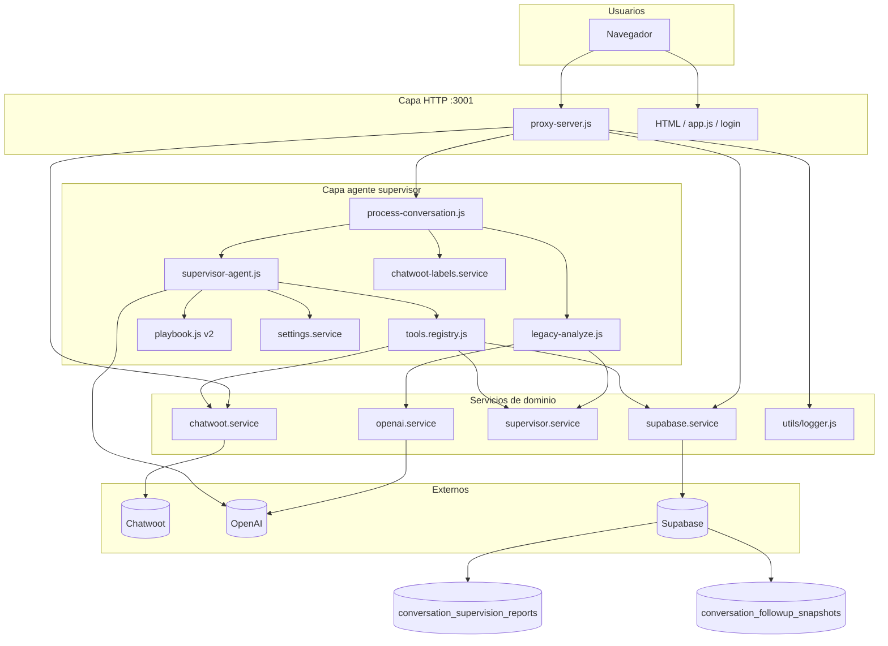
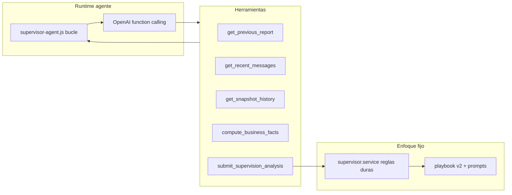
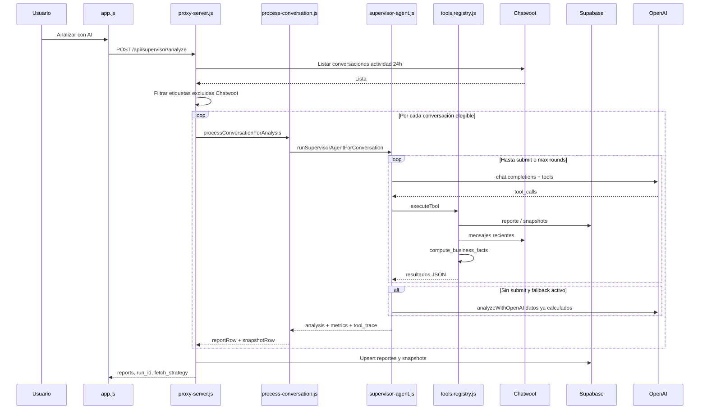
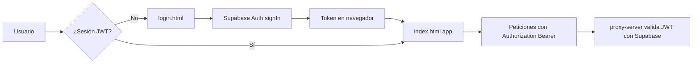

# Ontime AI Supervisor

Plataforma web interna para **On Time Cocinas (México)** que conecta **Chatwoot**, **OpenAI** y **Supabase** en un solo servicio Node.js. Sirve un dashboard operativo, un **supervisor de calidad comercial con IA** y herramientas de seguimiento diario, con **login** y APIs protegidas por JWT de Supabase.

Ejecución: `npm start` o **Docker** (`Dockerfile`, `docker-compose.yml`). Guía de contenedores y VPS: [`dockerman.md`](dockerman.md).

---

## Qué hace el software hoy

El programa no es solo un extractor de Chatwoot: es un **hub de supervisión** para equipos de venta y atención que ya usan Chatwoot como CRM de conversaciones.

### 1. Dashboard operativo (tablero Chatwoot)

- Consulta la API de Chatwoot **por sucursal/inbox** (Hermosillo, Nogales, Obregón, etc.).
- Por cada conversación obtiene mensajes y detecta el **último mensaje saliente** (no privado).
- **Agrupa por contacto**: un cliente con varias conversaciones aparece una sola vez (la fila con el saliente más reciente).
- **Oculta** filas cuyo último saliente lo envió el agente AI configurado (por defecto **Super Admin**).
- Muestra teléfono, asesor, canal, estado y **enlace directo** a la conversación en el panel de Chatwoot.
- Búsqueda, orden, paginación, estadísticas, lista de IDs y **exportación CSV**.

### 2. Supervisor AI (agente con herramientas — modo por defecto)

Cada conversación activa se supervisa con un **agente OpenAI** que sigue el **playbook v2 (cliente)** y llama **herramientas** (function calling). **No resume chats**: evalúa desempeño comercial en **lead** y **asesor_venta** con modelo **CERRAR**; el resto va a **fuera_de_alcance**. Prompt: `supervisor/prompts/supervisor-ontime-v2.md`.

**Modo alternativo (legacy):** un solo prompt JSON sin tools → `SUPERVISOR_AGENT_MODE=false` o `SUPERVISOR_LEGACY_MODE=true`.

### 2b. Detalle del análisis (agente y legacy)

- Analiza **solo conversaciones del canal con actividad reciente** (ventana por defecto **24 h**, `CHATWOOT_ACTIVITY_WINDOW_HOURS`).
- De Chatwoot trae **únicamente los mensajes de esa ventana**; el contexto largo viene del **reporte anterior en Supabase** (resumen, etapa, métricas, cotización).
- Por conversación genera: evaluación comercial (no resumen), etapa `lead` / `asesor_venta` / `fuera_de_alcance`, riesgo, score (o `no_aplica`), CERRAR, castigos, alertas, recomendación.
- Evalúa por separado **AI Agent** vs **arquitectos humanos** (lista configurable) vs otros asesores.
- **Cotización enviada**: detección determinística por URL oficial de sucursal (`*.ontimecocinas.com`); la IA no puede contradecirla.
- **Etiqueta** `inactiva_interes_real` si lleva **≥ 2 días** sin interacción (`INACTIVE_DAYS_THRESHOLD`) y hubo interés comercial previo.
- Guarda/actualiza un reporte por `conversation_id` en Supabase y un **snapshot diario** de actividad.

### 3. Reportes y seguimiento diario

- **Reportes**: historial de análisis guardados, filtrables por sucursal y riesgo.
- **Seguimiento diario**: compara snapshots **hoy vs ayer** en etapas `lead` y `asesor_venta` (compatibilidad con etapas legacy en BD).

### 4. Seguridad y operación

- **Login** (`/login.html`) con Supabase Auth (email/contraseña).
- APIs `/api/supervisor/*` y proxy `/chatwoot/*` exigen **JWT** si `AUTH_REQUIRED=true`.
- **Logging** por ejecución (`run_id`): pasos, tiempos, tamaño del prompt a OpenAI, errores Chatwoot (consola, panel en UI, `GET /api/supervisor/logs`).

### 5. Proxy CORS hacia Chatwoot

- El navegador no llama a Chatwoot directo: usa `/chatwoot/...` en el mismo origen.
- Evita bloqueos CORS y permite token de Chatwoot en servidor (`CHATWOOT_API_TOKEN`).

### 6. Configuración del agente (cuarta pestaña)

- Ruta directa: `?tab=configuracion` o pestaña **Configuración del agente**.
- Panel **Configuración actual**: playbook, modelo, arquitectos, ventana Chatwoot, temperatura, rondas del agente, **etiquetas excluidas**.
- Edición del **system prompt efectivo** (playbook integrado o personalizado), texto extra de workflow, lista de arquitectos (catálogo + chips).
- **Backups** automáticos al guardar; restauración desde historial en la UI.
- Persistencia en `data/agent-settings.json` (no versionado; defaults en `config/agent-settings.defaults.json`).
- **Etiquetas Chatwoot excluidas**: si la conversación tiene alguna etiqueta de la lista, **no se analiza** (`skipped_excluded_labels` en la respuesta de analyze).

---

## Arquitectura (vista general)

Capas: **HTTP** (`proxy-server.js`) → **agente** (orquestación + tools) → **servicios** (Chatwoot, Supabase, reglas de negocio) → **OpenAI**.



---

## Arquitectura del agente supervisor

El agente es **híbrido**: el LLM razona y redacta; las **herramientas** leen/escriben datos; el **código** garantiza reglas que no se negocian (cotización por URL, etiqueta de inactividad).



### Módulos del agente

| Archivo | Responsabilidad |
|---------|-----------------|
| `agent/analyze-config.js` | Modo agente vs legacy, `MAX_ROUNDS`, `MAX_TOOLS_PER_ROUND`, fallback |
| `agent/process-conversation.js` | Punto de entrada por conversación desde `POST /analyze` |
| `agent/supervisor-agent.js` | Bucle OpenAI: tools → respuestas → hasta `submit` o límite |
| `agent/tools.registry.js` | Definición y ejecución de las 5 herramientas |
| `agent/legacy-analyze.js` | Pipeline antiguo (un prompt) si legacy está activo |
| `supervisor/playbook.js` | Carga playbook v1/v2, system prompt efectivo, esquema JSON |
| `supervisor/analysis-normalize.js` | Validación y normalización del JSON (v2: `fuera_de_alcance`, scores) |
| `supervisor/settings.service.js` | Lectura/escritura de `data/agent-settings.json` y backups |
| `supervisor/playbook-v1.md` / `playbook-v2.md` | Documentación humana por versión |
| `supervisor/prompts/supervisor-ontime-v2.md` | Texto del playbook v2 (cliente) |
| `supervisor/constants.js` | AI Agent, arquitectos, dominios de cotización |
| `services/chatwoot-labels.service.js` | Etiquetas excluidas antes del análisis |

### Herramientas (function calling)

| Herramienta | Qué hace |
|-------------|----------|
| `get_previous_report` | Reporte previo en Supabase (resumen, etapa, métricas) |
| `get_recent_messages` | Mensajes públicos de Chatwoot en la ventana (p. ej. 24 h) |
| `get_snapshot_history` | Snapshots diarios de seguimiento |
| `compute_business_facts` | Métricas, cotización URL, inactividad, enrichment para el LLM |
| `submit_supervision_analysis` | JSON final; valida schema y aplica merge de reglas |

### Límites y fallback

| Control | Variable | Defecto |
|---------|----------|---------|
| Rondas máximas del agente | `SUPERVISOR_AGENT_MAX_ROUNDS` | 10 |
| Tools por ronda | `SUPERVISOR_AGENT_MAX_TOOLS_PER_ROUND` | 5 |
| Fallback si no hay `submit` | `SUPERVISOR_AGENT_LEGACY_FALLBACK` | `true` |

Si el agente agota rondas pero ya ejecutó `compute_business_facts`, puede usar **fallback**: un `analyzeWithOpenAI` con el enrichment ya calculado (mismo JSON y mismas reglas post-proceso).

Documentación extendida: [`supervisor/playbook-v2.md`](supervisor/playbook-v2.md) (defecto) · [`supervisor/playbook-v1.md`](supervisor/playbook-v1.md) (legacy).

---

## Flujo del análisis AI (cada ejecución)



---

## Flujo de autenticación



---

## Interfaz: cuatro pestañas

| Pestaña | Función |
|---------|---------|
| **Supervisor AI** | Configuración Chatwoot, análisis incremental, log de ejecución, resumen de conversaciones ignoradas por etiqueta |
| **Reportes** | Consulta de análisis persistidos en Supabase (badge naranja `fuera_de_alcance` en etapas fuera de alcance v2) |
| **Seguimiento diario** | Diff de snapshots por etapa (`lead`, `asesor_venta`) y sincronización del día |
| **Configuración del agente** | Playbook v2, prompt, arquitectos, parámetros LLM, etiquetas excluidas, backups y restauración |

---

## Stack técnico

| Capa | Tecnología |
|------|------------|
| Servidor HTTP | Node.js 20+, `proxy-server.js` |
| Agente supervisor | OpenAI function calling + `agent/*` + playbook v2 (configurable) |
| Servicios | `services/*` (Chatwoot, Supabase, reglas, OpenAI legacy) |
| Frontend | HTML + CSS + `app.js` (sin framework) |
| Auth cliente | `auth.js` + Supabase JS (CDN en login) |
| IA | OpenAI API (`OPENAI_MODEL`) |
| Persistencia | Supabase PostgreSQL (reportes + snapshots + Auth) |
| CRM fuente | Chatwoot REST API |
| Contenedores | Docker Alpine, puerto **3001** |

---

## Estructura del proyecto

```
Ontime AI Supervisor/
├── proxy-server.js        # Servidor HTTP: estáticos, auth, rutas API, proxy Chatwoot
├── services/
│   ├── chatwoot.service.js        # API Chatwoot (conversaciones, mensajes)
│   ├── chatwoot-labels.service.js # Filtro por etiquetas excluidas
│   ├── openai.service.js          # Análisis legacy (un prompt JSON)
│   ├── supabase.service.js        # Persistencia y auth JWT
│   └── supervisor.service.js      # Lógica de supervisión (métricas, cotización, followup)
├── agent/
│   ├── analyze-config.js          # Modo agente vs legacy, límites (mezcla .env + settings)
│   ├── tools.registry.js          # Herramientas del supervisor
│   ├── supervisor-agent.js        # Bucle OpenAI + tools + fallback
│   ├── process-conversation.js    # Orquestación por conversación (usado en /analyze)
│   └── legacy-analyze.js          # Pipeline legacy opt-in
├── supervisor/
│   ├── playbook.js                # Carga playbook v1/v2 y prompts
│   ├── analysis-normalize.js      # Validación JSON de salida
│   ├── settings.service.js        # API y archivo agent-settings.json
│   ├── playbook-v1.md / playbook-v2.md
│   ├── prompts/supervisor-ontime-v2.md
│   └── constants.js               # AI Agent, arquitectos, dominios cotización
├── config/
│   ├── agent-settings.defaults.json
│   └── supervisor-excluded-labels.json   # Semilla de etiquetas excluidas
├── data/                          # Runtime (gitignore): settings + backups
│   ├── agent-settings.json
│   └── backups/
├── utils/
│   └── logger.js                  # Logs estructurados por run_id
├── auth.js                        # Sesión Supabase en el navegador
├── app.js                         # UI: 4 pestañas + configuración agente
├── index.html                     # App principal (?tab=configuracion)
├── login.html             # Inicio de sesión
├── supabase-schema.sql    # Tablas reportes + snapshots
├── package.json
├── Dockerfile
├── docker-compose.yml
├── dockerman.md           # Docker local y despliegue (Contabo, EasyPanel, etc.)
├── .env.example
└── README.md
```

---

## Cómo arrancar

### Node

```bash
npm install
cp .env.example .env   # completar secretos
npm start
```

- App: `http://127.0.0.1:3001/`
- Login: `http://127.0.0.1:3001/login.html`

### Docker

```bash
docker compose up --build -d
```

Recomendado: `http://localhost:8080/` con **Proxy local** vacío en la UI.

---

## Variables de entorno principales

| Variable | Uso |
|----------|-----|
| `CHATWOOT_DEFAULT_BASE_URL` | Instancia Chatwoot |
| `CHATWOOT_ACCOUNT_ID` / `CHATWOOT_API_TOKEN` | Cuenta y token API |
| `OPENAI_API_KEY` / `OPENAI_MODEL` | Supervisor AI |
| `SUPABASE_URL` | Proyecto Supabase |
| `SUPABASE_ANON_KEY` | Login en navegador |
| `SUPABASE_SERVICE_ROLE_KEY` | Backend (reportes, validar JWT) |
| `AUTH_REQUIRED` | `true` en producción; `false` solo desarrollo |
| `CHATWOOT_ACTIVITY_WINDOW_HOURS` | Ventana de actividad (defecto 24) |
| `INACTIVE_DAYS_THRESHOLD` | Días para etiqueta inactiva (defecto 2) |
| `AI_AGENT_SENDER_NAME` | Usuario Chatwoot del bot (defecto Super Admin) |
| `ARCHITECT_SENDER_NAMES` | Arquitectos humanos a evaluar |
| `SUPERVISOR_LOG_LEVEL` | Logging: debug \| info \| warn \| error |
| `SUPERVISOR_AGENT_MODE` | `true` = agente con tools (defecto); `false` = legacy |
| `SUPERVISOR_LEGACY_MODE` | `true` = forzar pipeline legacy |
| `SUPERVISOR_AGENT_MAX_ROUNDS` | Rondas máximas del bucle agente |
| `SUPERVISOR_AGENT_MAX_TOOLS_PER_ROUND` | Tools ejecutadas por ronda |
| `SUPERVISOR_AGENT_LEGACY_FALLBACK` | Fallback a prompt JSON si no hay `submit` |
| `SUPERVISOR_PLAYBOOK_VERSION` | `v2` (cliente: lead/asesor_venta, CERRAR) o `v1` legacy |
| `SUPERVISOR_EXCLUDED_CHATWOOT_LABELS` | CSV opcional; si no, lista en UI / `config/supervisor-excluded-labels.json` |
| `SUPERVISOR_SETTINGS_PATH` | Ruta del JSON de configuración UI (defecto `data/agent-settings.json`) |
| `SUPERVISOR_SETTINGS_BACKUPS_DIR` | Carpeta de backups al guardar en UI |
| `SUPERVISOR_SETTINGS_MAX_BACKUPS` | Máximo de backups conservados |
| `SUPERVISOR_OPENAI_TEMPERATURE` | Temperatura del modelo (también en UI) |
| `FOLLOWUP_STAGES` | Etapas del seguimiento diario (defecto `lead,asesor_venta`) |

Plantilla completa: [`.env.example`](.env.example).

Tras cambiar `SUPERVISOR_PLAYBOOK_VERSION` en `.env`, **reinicia el servidor** (o recrea el contenedor Docker) para que el proceso cargue el prompt correcto.

Antes del primer uso: ejecutar [`supabase-schema.sql`](supabase-schema.sql) en Supabase y crear usuarios en **Authentication → Users**.

---

## APIs expuestas

### Autenticación

| Método | Ruta | Descripción |
|--------|------|-------------|
| GET | `/api/auth/config` | URL Supabase, anon key, si auth está activa |
| GET | `/api/auth/session` | Valida Bearer JWT |

### Supervisor (requieren JWT si auth activa)

| Método | Ruta | Descripción |
|--------|------|-------------|
| GET | `/api/supervisor/health` | Estado, `supervisor_agent_mode`, `playbook_version`, `agent_max_rounds` |
| POST | `/api/supervisor/analyze` | Análisis por conversación (agente o legacy) + guardado |
| GET | `/api/supervisor/reports` | Listado de reportes |
| GET | `/api/supervisor/followup` | Seguimiento día a día |
| POST | `/api/supervisor/followup/sync` | Snapshots del día |
| GET | `/api/supervisor/logs` | Runs de log recientes |
| GET | `/api/supervisor/logs/{run_id}` | Detalle de un run |
| GET | `/api/supervisor/settings` | Configuración vigente (mezcla archivo + `.env`) |
| PUT | `/api/supervisor/settings` | Guardar configuración (crea backup) |
| POST | `/api/supervisor/settings/reset` | Restaurar defaults de `config/agent-settings.defaults.json` |
| GET | `/api/supervisor/settings/backups` | Listar backups del prompt/config |
| POST | `/api/supervisor/settings/restore` | Restaurar desde un backup (`backup_id`) |

La respuesta de `POST /analyze` puede incluir: `skipped_excluded_labels`, `skipped_conversations`, `eligible_after_label_filter`.

### Proxy Chatwoot

`GET/POST … /chatwoot/api/v1/...` → reenvía a tu instancia con `api_access_token` y cabecera `x-chatwoot-base-url`.

---

## Histórico en Supabase vs mensajes de Chatwoot

| Fuente | Qué aporta al análisis |
|--------|------------------------|
| **Chatwoot (24 h)** | Mensajes recientes y listado de conversaciones activas |
| **Supabase (reporte previo)** | Resumen, recomendación, etapa, métricas, cotización ya detectada |
| **Supabase (snapshots)** | Seguimiento comparativo por fecha |

No se almacena el chat completo línea a línea en BD: se acumula **conocimiento por resúmenes y métricas**. Cada análisis **reemplaza** el reporte de esa `conversation_id` (upsert).

---

## Inicio de sesión (Supabase Auth)

1. Activar proveedor **Email** en Supabase.
2. Crear usuarios en **Authentication → Users**.
3. Configurar `SUPABASE_ANON_KEY` y `AUTH_REQUIRED=true` en `.env`.
4. Reiniciar el servidor.

Sin `SUPABASE_ANON_KEY`, la página de login muestra un aviso de configuración (no redirige en silencio a la app).

---

## Logging y depuración

Tras **Analizar con AI**:

- Panel **Log de ejecución** en la UI.
- Campo `run_id` y objeto `debug` en la respuesta.
- Consola del servidor con pasos y `duration_ms`.
- Opcional: `SUPERVISOR_LOG_TO_FILE=true` → archivos en `./logs/`.

Señales útiles:

| Evento en log | Significado |
|---------------|-------------|
| `agent_tool_call` | Herramienta invocada por el agente |
| `agent_legacy_fallback` | No hubo `submit`; se usó prompt JSON con datos ya calculados |
| `openai_chat_completion` | Llamada LLM (legacy o fallback) |
| `chatwoot_http_error` | Error al leer Chatwoot |
| `llm_payload_large` | Payload muy grande al modelo |

La respuesta de `POST /analyze` incluye `fetch_strategy` (p. ej. `agente_herramientas_playbook_v2`), `supervisor_agent_mode`, `playbook_version` y contadores de filtro por etiquetas.

---

## Personalización rápida

- **Inboxes / sucursales**: `<option>` en `#cw-branch` (`index.html`) y `BRANCH_NAME_BY_ID` en `app.js`.
- **Dominios de cotización**: `QUOTE_URL_REGIONS` en `supervisor/constants.js`.
- **Playbook v2 (texto largo)**: `supervisor/prompts/supervisor-ontime-v2.md` o pestaña **Configuración del agente** (con backups).
- **Playbook v1 (legacy)**: `SUPERVISOR_PLAYBOOK_VERSION=v1` + `supervisor/playbook-v1.md`.
- **Etiquetas que no se analizan**: UI (chips naranjas) o `SUPERVISOR_EXCLUDED_CHATWOOT_LABELS` / `config/supervisor-excluded-labels.json`.
- **Arquitectos y AI Agent**: UI o `ARCHITECT_SENDER_NAMES` / `AI_AGENT_SENDER_NAME` en `.env`.
- **Herramientas del agente**: `agent/tools.registry.js`.
- **Excluir agente del dashboard operativo**: `OUTBOUND_SENDER_EXCLUDE` en `app.js`.
- **Zona horaria seguimiento**: `FOLLOWUP_TIMEZONE` (defecto `America/Hermosillo`).

---

## Limitaciones

- El análisis recorre conversaciones activas **en serie** (varias rondas OpenAI por conversación en modo agente).
- Costo de tokens según volumen de actividad, número de tools y rondas del agente.
- El histórico en BD es **resumen**, no transcript completo acumulado.
- Secretos solo en `.env` / variables del panel de despliegue; no subir `.env` a Git.

---

## Licencia / uso

Uso interno — On time cocinas / Ontime. Ajusta URLs, tokens, cuentas e inboxes según tu entorno.
