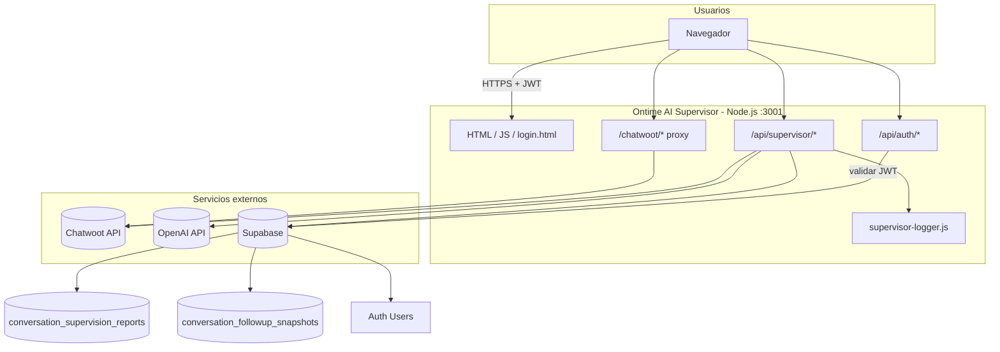
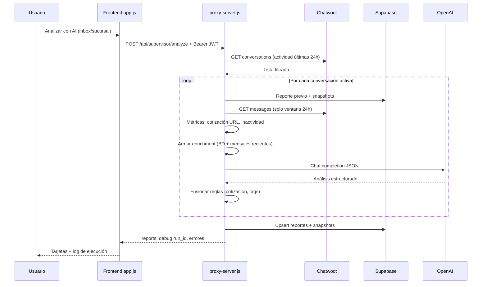
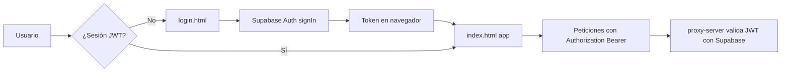

# Ontime AI Supervisor

Plataforma web interna para **On Time Cocinas (México)** que conecta **Chatwoot**, **OpenAI** y **Supabase** en un solo servicio Node.js. Sirve un dashboard operativo, un **supervisor de calidad comercial con IA** y herramientas de seguimiento diario, con **login** y APIs protegidas por JWT de Supabase.

Ejecución: `npm start` o **Docker** (`Dockerfile`, `docker-compose.yml`). Guía de contenedores y VPS: [`dockerman.md`](dockerman.md).

---

## Qué hace el software hoy

El programa no es solo un extractor de Chatwoot: es un **hub de supervisión** para equipos de venta y atención que ya usan Chatwoot como CRM de conversaciones.

### 1. Dashboard operativo (tablero Chatwoot)

- Consulta la API de Chatwoot **por sucursal/inbox** (Hermosillo, Nogales, Obregón, etc.).
- Por cada conversación obtiene mensajes y detecta el **último mensaje saliente** (no privado).
- **Agrupa por contacto**: un cliente con varias conversaciones aparece una sola vez (la fila con el saliente más reciente).
- **Oculta** filas cuyo último saliente lo envió el agente AI configurado (por defecto **Super Admin**).
- Muestra teléfono, asesor, canal, estado y **enlace directo** a la conversación en el panel de Chatwoot.
- Búsqueda, orden, paginación, estadísticas, lista de IDs y **exportación CSV**.

### 2. Supervisor AI (análisis con OpenAI)

- Analiza **solo conversaciones del canal con actividad reciente** (ventana por defecto **24 h**, `CHATWOOT_ACTIVITY_WINDOW_HOURS`).
- De Chatwoot trae **únicamente los mensajes de esa ventana**; el contexto largo viene del **reporte anterior en Supabase** (resumen, etapa, métricas, cotización).
- Por conversación genera: etapa del embudo, riesgo, score, sentimiento, alertas, resumen, recomendación.
- Evalúa por separado **AI Agent** vs **arquitectos humanos** (lista configurable) vs otros asesores.
- **Cotización enviada**: detección determinística por URL oficial de sucursal (`*.ontimecocinas.com`); la IA no puede contradecirla.
- **Etiqueta** `inactiva_interes_real` si lleva **≥ 2 días** sin interacción (`INACTIVE_DAYS_THRESHOLD`) y hubo interés comercial previo.
- Guarda/actualiza un reporte por `conversation_id` en Supabase y un **snapshot diario** de actividad.

### 3. Reportes y seguimiento diario

- **Reportes**: historial de análisis guardados, filtrables por sucursal y riesgo.
- **Seguimiento diario**: compara snapshots **hoy vs ayer** en etapas como `asesor_ventas` y `cotizacion_pendiente` (seguimiento humano, cliente sin respuesta, etc.).

### 4. Seguridad y operación

- **Login** (`/login.html`) con Supabase Auth (email/contraseña).
- APIs `/api/supervisor/*` y proxy `/chatwoot/*` exigen **JWT** si `AUTH_REQUIRED=true`.
- **Logging** por ejecución (`run_id`): pasos, tiempos, tamaño del prompt a OpenAI, errores Chatwoot (consola, panel en UI, `GET /api/supervisor/logs`).

### 5. Proxy CORS hacia Chatwoot

- El navegador no llama a Chatwoot directo: usa `/chatwoot/...` en el mismo origen.
- Evita bloqueos CORS y permite token de Chatwoot en servidor (`CHATWOOT_API_TOKEN`).

---

## Arquitectura (vista general)



---

## Flujo del análisis AI (cada ejecución)



---

## Flujo de autenticación



---

## Interfaz: tres pestañas

| Pestaña | Función |
|---------|---------|
| **Supervisor AI** | Configuración Chatwoot, análisis incremental, log de ejecución |
| **Reportes** | Consulta de análisis persistidos en Supabase |
| **Seguimiento diario** | Diff de snapshots por etapa y sincronización del día |

---

## Stack técnico

| Capa | Tecnología |
|------|------------|
| Servidor | Node.js 20+, `proxy-server.js` monolito |
| Frontend | HTML + CSS + `app.js` (sin framework) |
| Auth cliente | `auth.js` + Supabase JS (CDN en login) |
| IA | OpenAI API (`OPENAI_MODEL`, JSON estructurado) |
| Persistencia | Supabase PostgreSQL (reportes + snapshots + Auth) |
| CRM fuente | Chatwoot REST API |
| Contenedores | Docker Alpine, puerto **3001** |

---

## Estructura del proyecto

```
Ontime AI Supervisor/
├── proxy-server.js        # Servidor HTTP: estáticos, auth, supervisor, proxy Chatwoot
├── supervisor-logger.js   # Logs estructurados por run_id
├── auth.js                # Sesión Supabase en el navegador
├── app.js                 # UI: dashboard, supervisor, reportes, seguimiento
├── index.html             # App principal (3 pestañas)
├── login.html             # Inicio de sesión
├── supabase-schema.sql    # Tablas reportes + snapshots
├── package.json
├── Dockerfile
├── docker-compose.yml
├── dockerman.md           # Docker local y despliegue (Contabo, EasyPanel, etc.)
├── .env.example
└── README.md
```

---

## Cómo arrancar

### Node

```bash
npm install
cp .env.example .env   # completar secretos
npm start
```

- App: `http://127.0.0.1:3001/`
- Login: `http://127.0.0.1:3001/login.html`

### Docker

```bash
docker compose up --build -d
```

Recomendado: `http://localhost:8080/` con **Proxy local** vacío en la UI.

---

## Variables de entorno principales

| Variable | Uso |
|----------|-----|
| `CHATWOOT_DEFAULT_BASE_URL` | Instancia Chatwoot |
| `CHATWOOT_ACCOUNT_ID` / `CHATWOOT_API_TOKEN` | Cuenta y token API |
| `OPENAI_API_KEY` / `OPENAI_MODEL` | Supervisor AI |
| `SUPABASE_URL` | Proyecto Supabase |
| `SUPABASE_ANON_KEY` | Login en navegador |
| `SUPABASE_SERVICE_ROLE_KEY` | Backend (reportes, validar JWT) |
| `AUTH_REQUIRED` | `true` en producción; `false` solo desarrollo |
| `CHATWOOT_ACTIVITY_WINDOW_HOURS` | Ventana de actividad (defecto 24) |
| `INACTIVE_DAYS_THRESHOLD` | Días para etiqueta inactiva (defecto 2) |
| `AI_AGENT_SENDER_NAME` | Usuario Chatwoot del bot (defecto Super Admin) |
| `ARCHITECT_SENDER_NAMES` | Arquitectos humanos a evaluar |
| `SUPERVISOR_LOG_LEVEL` | Logging: debug \| info \| warn \| error |

Plantilla completa: [`.env.example`](.env.example).

Antes del primer uso: ejecutar [`supabase-schema.sql`](supabase-schema.sql) en Supabase y crear usuarios en **Authentication → Users**.

---

## APIs expuestas

### Autenticación

| Método | Ruta | Descripción |
|--------|------|-------------|
| GET | `/api/auth/config` | URL Supabase, anon key, si auth está activa |
| GET | `/api/auth/session` | Valida Bearer JWT |

### Supervisor (requieren JWT si auth activa)

| Método | Ruta | Descripción |
|--------|------|-------------|
| GET | `/api/supervisor/health` | Estado y configuración |
| POST | `/api/supervisor/analyze` | Análisis incremental + guardado |
| GET | `/api/supervisor/reports` | Listado de reportes |
| GET | `/api/supervisor/followup` | Seguimiento día a día |
| POST | `/api/supervisor/followup/sync` | Snapshots del día |
| GET | `/api/supervisor/logs` | Runs de log recientes |
| GET | `/api/supervisor/logs/{run_id}` | Detalle de un run |

### Proxy Chatwoot

`GET/POST … /chatwoot/api/v1/...` → reenvía a tu instancia con `api_access_token` y cabecera `x-chatwoot-base-url`.

---

## Histórico en Supabase vs mensajes de Chatwoot

| Fuente | Qué aporta al análisis |
|--------|------------------------|
| **Chatwoot (24 h)** | Mensajes recientes y listado de conversaciones activas |
| **Supabase (reporte previo)** | Resumen, recomendación, etapa, métricas, cotización ya detectada |
| **Supabase (snapshots)** | Seguimiento comparativo por fecha |

No se almacena el chat completo línea a línea en BD: se acumula **conocimiento por resúmenes y métricas**. Cada análisis **reemplaza** el reporte de esa `conversation_id` (upsert).

---

## Inicio de sesión (Supabase Auth)

1. Activar proveedor **Email** en Supabase.
2. Crear usuarios en **Authentication → Users**.
3. Configurar `SUPABASE_ANON_KEY` y `AUTH_REQUIRED=true` en `.env`.
4. Reiniciar el servidor.

Sin `SUPABASE_ANON_KEY`, la página de login muestra un aviso de configuración (no redirige en silencio a la app).

---

## Logging y depuración

Tras **Analizar con AI**:

- Panel **Log de ejecución** en la UI.
- Campo `run_id` y objeto `debug` en la respuesta.
- Consola del servidor con pasos y `duration_ms`.
- Opcional: `SUPERVISOR_LOG_TO_FILE=true` → archivos en `./logs/`.

Señales útiles: `openai_chat_completion` (cuelgue en LLM), `chatwoot_http_error` (datos Chatwoot), `llm_payload_large` (demasiado texto al modelo).

---

## Personalización rápida

- **Inboxes / sucursales**: `<option>` en `#cw-branch` (`index.html`) y `BRANCH_NAME_BY_ID` en `app.js`.
- **Dominios de cotización**: `QUOTE_URL_REGIONS` en `proxy-server.js`.
- **Excluir agente del dashboard operativo**: `OUTBOUND_SENDER_EXCLUDE` en `app.js`.
- **Zona horaria seguimiento**: `FOLLOWUP_TIMEZONE` (defecto `America/Hermosillo`).

---

## Limitaciones

- El análisis recorre conversaciones activas **en serie** (una petición OpenAI por conversación).
- Costo de tokens según volumen de actividad en la ventana de 24 h.
- El histórico en BD es **resumen**, no transcript completo acumulado.
- Secretos solo en `.env` / variables del panel de despliegue; no subir `.env` a Git.

---

## Licencia / uso

Uso interno — On time cocinas / Ontime. Ajusta URLs, tokens, cuentas e inboxes según tu entorno.
