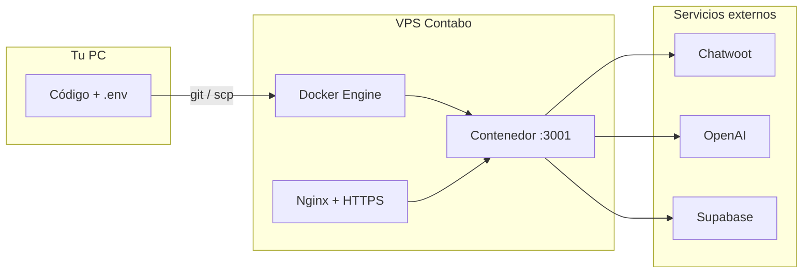

# Docker — Ontime AI Supervisor (Chatwoot Dashboard)

Guía para **arrancar**, **mantener** y **migrar** este proyecto desde tu PC local a un **VPS en Contabo** usando Docker y Docker Compose.

---

## Resumen del stack

| Componente | Detalle |
|------------|---------|
| Imagen base | `node:22-alpine` |
| Proceso | `node proxy-server.js` (UI estática + proxy Chatwoot + API Supervisor AI) |
| Puerto interno del contenedor | **3001** |
| Puertos publicados (por defecto) | **8080→3001** y **3001→3001** |
| Servicio Compose | `chatwoot-dashboard` |
| Secretos | Van en `.env` en el host; **no** se copian a la imagen (`.dockerignore` excluye `.env`) |
| Configuración UI | Volumen `./data:/app/data` → `agent-settings.json` y backups del prompt |
| Variables completas | `env_file: .env` en Compose (playbook v2, etiquetas excluidas, settings, etc.) |

---

## Requisitos

### En tu PC (desarrollo)

- [Docker Desktop](https://www.docker.com/products/docker-desktop/) (Windows/macOS) o Docker Engine (Linux)
- Docker Compose v2 (`docker compose`, no solo `docker-compose` antiguo)

Comprobar:

```bash
docker --version
docker compose version
```

### En el VPS Contabo (producción)

- Ubuntu 22.04 / 24.04 LTS (recomendado)
- Acceso SSH como root o usuario con `sudo`
- Dominio opcional pero recomendado (ej. `supervisor.tudominio.com`) para HTTPS
- Mismas claves que en local: **Chatwoot**, **OpenAI**, **Supabase** (el SQL de `supabase-schema.sql` ya ejecutado en Supabase)

---

## Primera vez en local

### 1. Clonar o copiar el proyecto

```bash
cd "ruta/al/proyecto/Ontime AI Supervisor"
```

### 2. Crear el archivo `.env`

Docker Compose **lee `.env` automáticamente** para sustituir variables en `docker-compose.yml` (por ejemplo `HOST_PORT`, `CHATWOOT_API_TOKEN`).

En Windows (PowerShell):

```powershell
Copy-Item .env.example .env
notepad .env
```

En Linux/macOS:

```bash
cp .env.example .env
nano .env
```

Rellena al menos:

| Variable | Uso |
|----------|-----|
| `CHATWOOT_API_TOKEN` | Token API de Chatwoot (backend; no hace falta pegarlo en el navegador si está aquí) |
| `CHATWOOT_ACCOUNT_ID` | ID de cuenta Chatwoot |
| `CHATWOOT_DEFAULT_BASE_URL` | Ej. `https://app.ontime.chat` |
| `OPENAI_API_KEY` | Supervisor AI |
| `SUPABASE_URL` | Proyecto Supabase |
| `SUPABASE_SERVICE_ROLE_KEY` | Solo servidor; nunca en el frontend |

Opcional: `HOST_PORT=8080` si quieres otro puerto público.

Recomendado en producción:

| Variable | Uso |
|----------|-----|
| `SUPERVISOR_PLAYBOOK_VERSION` | `v2` (defecto en `.env.example`) — lead/asesor_venta, CERRAR |
| `SUPERVISOR_EXCLUDED_CHATWOOT_LABELS` | CSV opcional de etiquetas Chatwoot a ignorar en analyze |
| `AUTH_REQUIRED` | `true` en producción |
| `SUPABASE_ANON_KEY` | Login en navegador |

> **Importante:** el `docker-compose.yml` del proyecto usa **`env_file: .env`** y el volumen **`./data:/app/data`**, de modo que casi todas las variables de `.env.example` llegan al contenedor y la pestaña **Configuración del agente** persiste entre reinicios. Tras cambiar `SUPERVISOR_PLAYBOOK_VERSION`, recrea el contenedor: `docker compose up -d --force-recreate`.

### 3. Supabase

En el panel de Supabase → SQL Editor, ejecuta el contenido de `supabase-schema.sql` (tablas de reportes y snapshots de seguimiento).

### 4. Construir y levantar

**Primer arranque (consola visible, útil para depurar):**

```bash
docker compose up --build
```

**Arranque en segundo plano (uso habitual):**

```bash
docker compose up --build -d
```

### 5. Abrir la aplicación

| URL | Cuándo usarla |
|-----|----------------|
| `http://localhost:8080/` | **Recomendado** con Docker (puerto `HOST_PORT`) |
| `http://127.0.0.1:3001/` | Si prefieres el mapeo directo 3001:3001 |

En la pantalla de configuración, deja **Proxy local** **vacío** si entras por la misma URL base (ej. `http://localhost:8080`). Así las peticiones van a `/chatwoot/...` en el mismo origen y evitas `ERR_CONNECTION_REFUSED`.

Pestañas de la app: **Supervisor AI**, **Reportes**, **Seguimiento diario**, **Configuración del agente** (`?tab=configuracion`). La configuración guardada vive en `./data/agent-settings.json` en el host (carpeta `data/` creada al primer guardado).

Comprobar salud del supervisor:

```bash
curl -s http://localhost:8080/api/supervisor/health
```

---

## Comandos de día a día

### Estado

```bash
docker compose ps
```

### Parar (sin borrar contenedores)

```bash
docker compose stop
```

### Parar y eliminar contenedores de este proyecto

```bash
docker compose down
```

### Reiniciar tras cambiar solo `.env`

```bash
docker compose up -d --force-recreate
```

### Reconstruir imagen (tras cambios en código o `Dockerfile`)

```bash
docker compose up --build -d
```

### Ver uso de recursos

```bash
docker stats
```

---

## Logs

### Seguir logs en tiempo real

```bash
docker compose logs -f
```

Solo el servicio de la app:

```bash
docker compose logs -f chatwoot-dashboard
```

### Últimas N líneas

```bash
docker compose logs --tail=100 chatwoot-dashboard
```

### Logs con marca de tiempo

```bash
docker compose logs -f -t chatwoot-dashboard
```

### Logs desde una fecha (Docker reciente)

```bash
docker compose logs --since 30m chatwoot-dashboard
```

### Inspeccionar el contenedor

```bash
docker compose exec chatwoot-dashboard sh
# dentro: wget -qO- http://127.0.0.1:3001/api/supervisor/health
```

---

## Puertos y conflictos

Por defecto en `docker-compose.yml`:

```yaml
ports:
  - "${HOST_PORT:-8080}:3001"
  - "3001:3001"
```

| Situación | Qué hacer |
|-----------|-----------|
| Puerto **8080** ocupado | `HOST_PORT=9090 docker compose up -d` o `HOST_PORT=9090` en `.env` |
| Ya corres `npm start` en **3001** del host | Comenta la línea `"3001:3001"` en `docker-compose.yml` o para Node antes de levantar Docker |
| Solo quieres un puerto en el VPS | Deja solo `8080:3001` (o `80:3001` detrás de Nginx) y comenta `3001:3001` |

---

## Variables de entorno y persistencia

### Compose actual (`env_file` + volumen `data/`)

```yaml
env_file:
  - .env
volumes:
  - ./data:/app/data
```

- **`env_file`**: inyecta todas las variables de `.env` (OpenAI, Supabase, playbook v2, etiquetas excluidas, límites del agente, etc.).
- **Volumen `data/`**: guarda `agent-settings.json` y `data/backups/` cuando usas la UI de configuración. Haz backup de esta carpeta en el VPS junto con `.env`.

El bloque `environment:` en Compose sigue definiendo valores explícitos para las claves críticas; si hay conflicto, prevalece lo declarado en `environment:` sobre `env_file`.

### Reinicio tras cambios

| Cambio | Comando |
|--------|---------|
| Solo `.env` | `docker compose up -d --force-recreate` |
| Código o Dockerfile | `docker compose up --build -d` |
| `SUPERVISOR_PLAYBOOK_VERSION` | Recrear contenedor (el proceso cachea el playbook al arrancar) |

### Ampliar variables manualmente (instalaciones antiguas)

Si tu `docker-compose.yml` no tiene `env_file`, añádelo como arriba o declara cada variable en `environment:`.

---

## Solo Docker (sin Compose)

```bash
docker build -t ontime-ai-supervisor .
mkdir -p data
docker run -d --name ontime-supervisor \
  -p 8080:3001 \
  --env-file .env \
  -v "$(pwd)/data:/app/data" \
  -e PORT=3001 \
  -e HOST=0.0.0.0 \
  ontime-ai-supervisor
```

Logs:

```bash
docker logs -f ontime-supervisor
```

---

## Migración: PC local → VPS Contabo

Flujo recomendado: **mismo `.env` de secretos**, código en el servidor, contenedor siempre con `docker compose up -d`.

### Diagrama



### Paso 1 — Crear el VPS en Contabo

1. Panel Contabo → VPS → crear instancia (Ubuntu LTS, región cercana a usuarios).
2. Anota **IP pública** y contraseña o sube tu **clave SSH**.
3. En firewall Contabo (si lo activas): permite **22** (SSH), **80** y **443** (web). No expongas **3001** a Internet si usas Nginx delante.

### Paso 2 — Conectar por SSH

```bash
ssh root@TU_IP_CONTABO
```

Actualizar sistema:

```bash
apt update && apt upgrade -y
```

### Paso 3 — Instalar Docker en el VPS

```bash
apt install -y ca-certificates curl
install -m 0755 -d /etc/apt/keyrings
curl -fsSL https://download.docker.com/linux/ubuntu/gpg -o /etc/apt/keyrings/docker.asc
chmod a+r /etc/apt/keyrings/docker.asc
echo "deb [arch=$(dpkg --print-architecture) signed-by=/etc/apt/keyrings/docker.asc] https://download.docker.com/linux/ubuntu $(. /etc/os-release && echo "$VERSION_CODENAME") stable" | tee /etc/apt/sources.list.d/docker.list > /dev/null
apt update
apt install -y docker-ce docker-ce-cli containerd.io docker-buildx-plugin docker-compose-plugin
systemctl enable docker
systemctl start docker
```

Comprobar:

```bash
docker compose version
```

### Paso 4 — Subir el proyecto al VPS

**Opción A — Git (recomendado si tienes repo privado)**

```bash
cd /opt
git clone https://github.com/TU_ORG/ontime-ai-supervisor.git
cd ontime-ai-supervisor
```

**Opción B — Copiar desde tu PC (sin Git)**

En tu PC (PowerShell), desde la carpeta del proyecto:

```powershell
scp -r ".\*" root@TU_IP_CONTABO:/opt/ontime-ai-supervisor/
```

Excluye manualmente `node_modules` (no hace falta en el servidor; la imagen hace `npm ci`).

**Opción C — Empaquetar**

En PC:

```bash
# ejemplo en Git Bash / WSL
tar --exclude=node_modules --exclude=.git -czf supervisor.tar.gz .
scp supervisor.tar.gz root@TU_IP_CONTABO:/opt/
```

En VPS:

```bash
mkdir -p /opt/ontime-ai-supervisor && cd /opt/ontime-ai-supervisor
tar -xzf ../supervisor.tar.gz
```

### Paso 5 — Configurar `.env` en el VPS

```bash
cd /opt/ontime-ai-supervisor
cp .env.example .env
nano .env
```

Copia los mismos secretos que en tu PC (`CHATWOOT_API_TOKEN`, `OPENAI_API_KEY`, `SUPABASE_*`, etc.).

Proteger el archivo:

```bash
chmod 600 .env
```

En producción puedes fijar:

```env
HOST_PORT=8080
```

(o mapear solo internamente y exponer vía Nginx).

### Paso 6 — Levantar en el VPS

```bash
cd /opt/ontime-ai-supervisor
docker compose up --build -d
docker compose ps
docker compose logs --tail=50
```

Prueba desde el VPS:

```bash
curl -s http://127.0.0.1:8080/api/supervisor/health
```

Desde tu PC (solo si abriste el puerto en firewall, no recomendado como solución final):

`http://TU_IP_CONTABO:8080/`

### Paso 7 — Nginx como reverse proxy + HTTPS

No dejes la app solo en `:8080` abierto al mundo sin TLS. Patrón habitual:

1. El contenedor escucha en `127.0.0.1:8080` (cambia el mapeo a `127.0.0.1:8080:3001` en `docker-compose.yml` en producción).
2. Nginx en el host termina SSL y proxy a ese puerto.

Instalar Nginx y Certbot:

```bash
apt install -y nginx certbot python3-certbot-nginx
```

Ejemplo de sitio `/etc/nginx/sites-available/ontime-supervisor`:

```nginx
server {
    listen 80;
    server_name supervisor.tudominio.com;

    location / {
        proxy_pass http://127.0.0.1:8080;
        proxy_http_version 1.1;
        proxy_set_header Host $host;
        proxy_set_header X-Real-IP $remote_addr;
        proxy_set_header X-Forwarded-For $proxy_add_x_forwarded_for;
        proxy_set_header X-Forwarded-Proto $scheme;
        # Análisis AI puede tardar varios minutos
        proxy_read_timeout 600s;
        proxy_send_timeout 600s;
    }
}
```

Activar y certificado:

```bash
ln -s /etc/nginx/sites-available/ontime-supervisor /etc/nginx/sites-enabled/
nginx -t && systemctl reload nginx
certbot --nginx -d supervisor.tudominio.com
```

En la UI, **Proxy local** vacío y accede por `https://supervisor.tudominio.com`.

### Paso 8 — Firewall en el VPS (UFW)

```bash
ufw allow OpenSSH
ufw allow 'Nginx Full'
ufw enable
ufw status
```

No abras el puerto 8080 públicamente si Nginx hace de frontal.

### Paso 9 — Arranque automático tras reinicio

Docker con `restart` en Compose. Añade en `docker-compose.yml` bajo `chatwoot-dashboard`:

```yaml
restart: unless-stopped
```

Luego:

```bash
docker compose up -d
```

El servicio `docker` ya suele arrancar con el sistema si lo habilitaste con `systemctl enable docker`.

---

## Mantenimiento en producción

### Actualizar código

```bash
cd /opt/ontime-ai-supervisor
git pull   # si usas Git
docker compose up --build -d
docker compose logs -f --tail=30
```

### Actualizar solo variables `.env`

```bash
nano .env
docker compose up -d --force-recreate
```

### Copia de seguridad

- **Imprescindible:** copia segura de `.env` (gestor de contraseñas o vault).
- **Recomendado:** carpeta host `./data/` (`agent-settings.json` + `data/backups/` del prompt).
- Los datos de reportes están en **Supabase**, no en el contenedor.
- No hace falta backup del contenedor; es desechable.

### Monitoreo básico

```bash
# ¿está corriendo?
docker compose ps

# ¿responde?
curl -sf http://127.0.0.1:8080/api/supervisor/health || echo "FALLO"

# espacio en disco
df -h
docker system df
```

### Limpiar imágenes antiguas (tras muchos builds)

```bash
docker image prune -f
```

---

## Checklist de migración

- [ ] VPS Contabo creado y accesible por SSH
- [ ] Docker + Compose instalados
- [ ] Proyecto en `/opt/ontime-ai-supervisor` (o ruta elegida)
- [ ] `.env` con todos los secretos (`chmod 600`)
- [ ] `supabase-schema.sql` ejecutado en Supabase
- [ ] `docker compose up --build -d` OK
- [ ] `curl` a `/api/supervisor/health` OK
- [ ] Nginx + HTTPS configurados
- [ ] Firewall: solo 22, 80, 443
- [ ] `restart: unless-stopped` en Compose
- [ ] UI probada: reporte Chatwoot + análisis Supervisor AI
- [ ] Volumen `./data` presente; configuración agente guardada si aplica
- [ ] `SUPERVISOR_PLAYBOOK_VERSION=v2` y health muestra `playbook_version: v2`

---

## Solución de problemas

| Síntoma | Causa probable | Acción |
|---------|----------------|--------|
| `ERR_CONNECTION_REFUSED` en el navegador | Proxy local apunta a `127.0.0.1:3001` pero solo está mapeado **8080** | Deja **Proxy local** vacío o usa la misma URL que la barra de direcciones |
| Puerto 3001 en uso en el host | `npm start` y Docker a la vez | Para Node o comenta `3001:3001` en Compose |
| `chatwoot_token_configured: false` en health | Falta `CHATWOOT_API_TOKEN` en `.env` o no se recreó el contenedor | Revisa `.env` y `docker compose up -d --force-recreate` |
| OpenAI / Supabase no funcionan | Claves vacías o no inyectadas al contenedor | Revisa `.env` y `env_file`; `docker compose exec chatwoot-dashboard env \| grep OPENAI` |
| Sigue playbook v1 tras poner v2 | Proceso no reiniciado | `docker compose up -d --force-recreate` |
| Se pierde configuración UI al rebuild | Sin volumen `data/` | Añade `- ./data:/app/data` en Compose |
| Conversaciones no se analizan | Etiqueta en lista excluida | Pestaña Configuración → etiquetas excluidas o `SUPERVISOR_EXCLUDED_CHATWOOT_LABELS` |
| Build lento o falla en `npm ci` | Red o `package-lock.json` desactualizado | En local: `npm install` y sube lock; en VPS: `docker compose build --no-cache` |
| 502 en Nginx | Contenedor parado o proxy a puerto equivocado | `docker compose ps`, `curl http://127.0.0.1:8080/` |
| Análisis AI cortado por timeout | Proxy con timeout bajo | Sube `proxy_read_timeout` en Nginx (ver ejemplo) |

### Ver qué variables ve el contenedor

```bash
docker compose exec chatwoot-dashboard env | sort
```

(No pegues la salida en tickets públicos: incluye secretos.)

---

## Seguridad (resumen)

1. **Nunca** subas `.env` a Git ni a imágenes públicas.
2. Usa **HTTPS** en producción; restringe acceso (VPN, IP allowlist en Nginx, o autenticación básica) si la URL es sensible.
3. `SUPABASE_SERVICE_ROLE_KEY` y `OPENAI_API_KEY` solo en el servidor.
4. En Contabo, desactiva login root por contraseña si usas claves SSH.
5. Mantén el VPS actualizado: `apt update && apt upgrade` periódicamente.

---

## Referencia rápida de archivos Docker

| Archivo | Función |
|---------|---------|
| `Dockerfile` | Imagen Node 22 Alpine, `npm ci`, copia `proxy-server.js`, UI y `images/` |
| `docker-compose.yml` | Build, puertos, `env_file`, volumen `data/`, variables explícitas |
| `.dockerignore` | Excluye `.env`, `node_modules`, `.git`, etc. del contexto de build |
| `.env.example` | Plantilla de configuración |

---

## Enlaces útiles

- [Documentación Docker Compose](https://docs.docker.com/compose/)
- [Contabo — VPS](https://contabo.com/en/vps/)
- README del proyecto: `README.md` (comportamiento de la app, API y Supabase)

---

*Uso interno — On time cocinas / Ontime. Ajusta dominios, puertos y rutas según tu entorno.*
